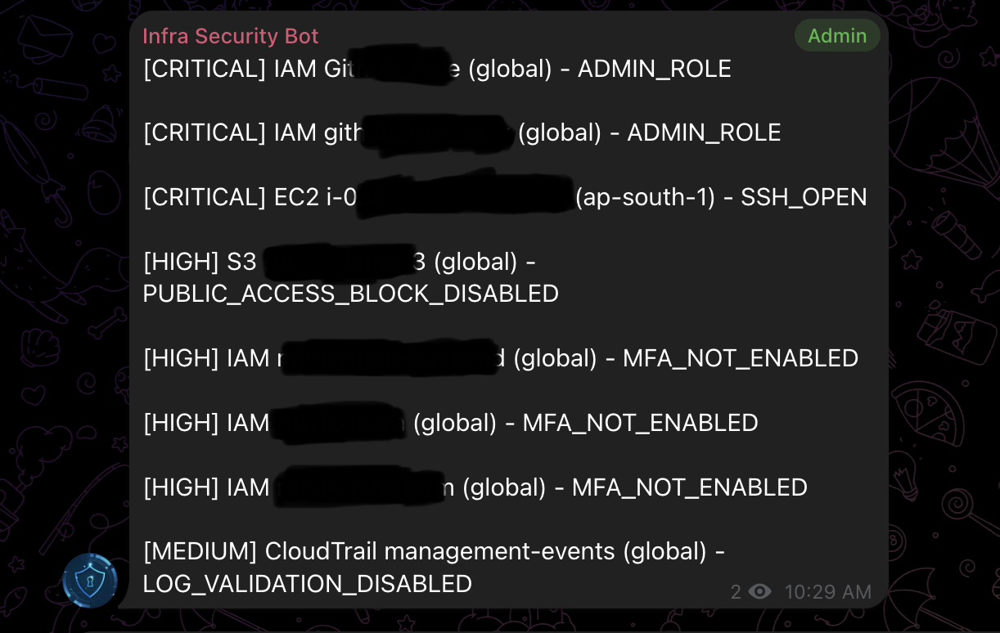

# InfraGuard

InfraGuard is a AWS security scanner that checks for common misconfigurations and sends alerts via Telegram and Slack.

---

## Features

- Scans AWS across regions

- Checks:
  - S3 public access
  - EC2 open ports (SSH/RDP)
  - NACL rules
  - Load balancer exposure
  - IAM issues (admin roles, MFA)
  - RDS security
  - CloudTrail status

- Severity-based alerts (CRITICAL, HIGH, etc.)

- Telegram / Slack notifications

- Configurable scan interval

---

## Demo



---

## Setup

### 1. Clone

```bash
git clone https://github.com/RutvikMendpara/InfraGuard.git
cd infraguard
pip install -r requirements.txt
```

---

### 2. Configure

```bash
cp .env.example .env
```

## Fill in your values in `.env`

### 3. AWS setup

Create an IAM user with read-only access.

Attach these policies:

- AmazonEC2ReadOnlyAccess
- AmazonRDSReadOnlyAccess
- AmazonS3ReadOnlyAccess
- AmazonVPCReadOnlyAccess
- AWSCloudTrail_ReadOnlyAccess
- IAMReadOnlyAccess

## Then generate access keys and add them to `.env`.

## Run

```bash
python main.py
```

---

## License

GNU GENERAL PUBLIC LICENSE Version 3
[License](License)
