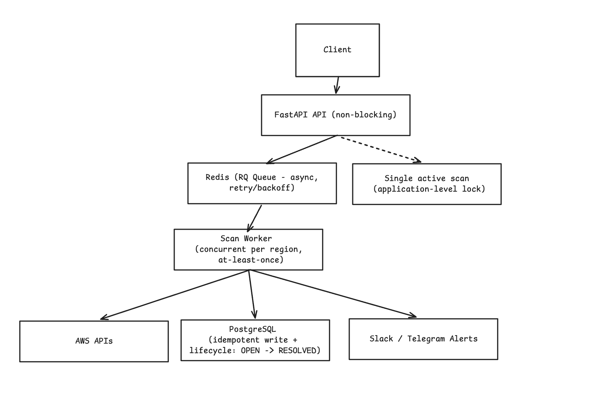

# Architecture Documentation

### Overview

InfraGuard is built as an asynchronous scanning system for AWS infrastructure. The API layer is intentionally kept non-blocking, while all heavy scanning work is offloaded to background workers.

### High-level flow

1. Client triggers scan via API
2. API creates a scan record in DB
3. Job is pushed to Redis queue (RQ)
4. Worker picks up job
5. Scanner runs across AWS services and regions
6. Findings are normalized and stored in PostgreSQL
7. Alerts are sent (Slack / Telegram)
8. Scan status is updated

### Key components

- FastAPI (API layer)
- Redis + RQ (queue + background jobs)
- PostgreSQL (persistent storage)
- Worker (scan execution)

### Design decisions

**Asynchronous execution**

- Avoid blocking API
- Better UX and scalability

**At-least-once execution**

- Jobs may retry on failure
- Tradeoff: possible duplicate execution

**Idempotency via hash**

- Each finding has deterministic hash
- Prevents duplicate DB entries

**Single active scan**

- Prevents conflicts and AWS throttling
- Enforced via DB check

### Failure handling

- Retry with exponential backoff (30, 60, 120 sec)
- Stale scans marked as FAILED
- Worker crash recovery on restart
